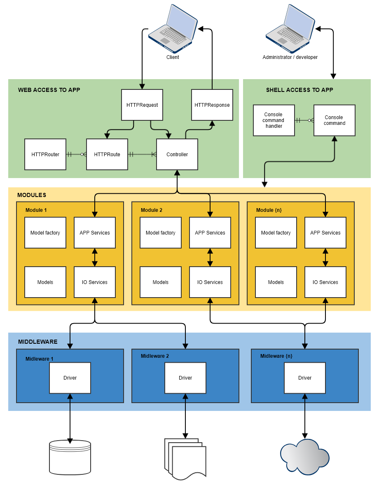

# ha framework
PHP 7.1 framework for professionals with high abstraction. This is really flexible framewrok without balast and is based on interfaces and some predefined instances, which can be changed at any moment. Framework is vendor package with small default required functionality. You can easly add and use everything, what you need. Custom packages, custom ORM, custom drivers...

Framework architecture is based on access type: application logic is strictly differenced from accessing method and from rendering method (such as HTTP application, Rest API application, mobile page, website, console, ...); SOA principes can be very easly applied to your code.

### Framework highlights

- based on PHP 7.1
- always strict typing, everything has interface, everything has also scalar typing and return value typing (automatically reduced >50% developers bugs)
- SEO ready (extra routing on cases, when MVC is bad way)
- precise HTTP handling (headers controll, request method checking, ...)
- ready for multiple data sources (very good support for multiple instances of the same type and also different type of drivers)
- cascade data IO operations (e.g. write to SQL, Elasticsearch, cache vs. read from cache, elasticsearch, SQL)
- default ORM not implemented, manipulation with data is open (we can have very complex objects on which are parts loaded from other datasource as primary data)
- extreme IDE support (everything is autocompleted, e.g. in *PHP Storm*)
- lightweight and allways reusable code (no useless packages in core functionality)
- based on interfaces (everything can be changed or extended without large code rewrites)
- everything is instance, static calls missing (very good dependency injection)
- low memory consuption
- model collections with type protection (e.g. category could not be added to products collection)
- model property typehinting
- access to model properties is case insensitive and camelCase/dash_case insensitive (very useful for cases, when db fields are dash_cased and properties camelCased, etc.)
- application structure is independed from usage (the same functionality with different access methods and rendering, such as API, web page, mobile page, shell access, ...; project is not only web page and has separated HTTP access)
- functionality versioning (the same project can works with versioned classes by environment, very usefull in development, we can try simply new version on the same host in production, we can use new version for web and API will works on old version, etc.)
- everything can be configured in config files and application is fully builded from config file (every environment can have different configuration, e.g. midlewares, modules, ...; environment is not only 'debug' or 'production', it can be e.g. host), it works similarly as docker-compose.yml
- SOA ready, you can easly write service oriented applications
- simulated string[], int[], float[], bool[] collections for better array type checking in PHP
- this is not wrong symphony wrapper such as laravel

### Framework functionality

Framework core is very simple and very effective glue between some application parts. Functionality ot this parts is divided to these areas:

- Logic components:
  - [Middleware](docs/middleware.md): glue to external functionality (drivers, packages, etc.)
  - [Modules](docs/modules.md): application logic (application services, IO services, models)
- Access to application:
  - [HTTP access](docs/http-routing.md): recieve and convert HTTP requests to HTTP responses (router, routes, controllers, request, response, rendering)
  - [Shell access](docs/shell.md): executing scripts from command line
 
Application functionality is based on [configuration](docs/app-configuration.md) in ha framework, please read, how can be application [configured](docs/app-configuration.md).

#### Functionality schema

