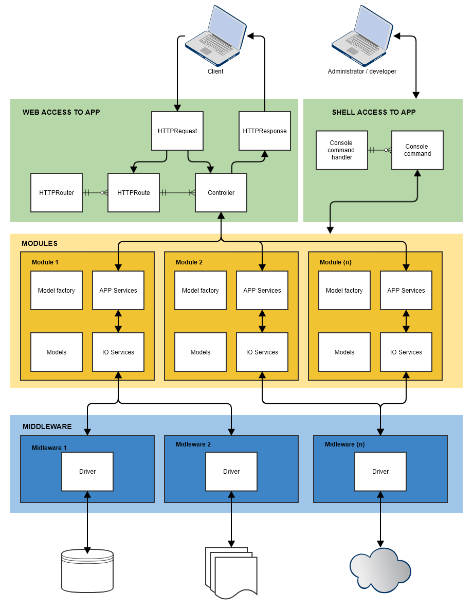

# Application structure in *ha* framework

Framework core is very simple and very effective glue between some application parts. These parts are divided into the following areas according to their functionality:

- **Logic components:**
  - [Middleware](middleware.md): proxy to some external functionality (drivers, packages, etc.)
  - [Modules](modules.md): application logic
    - [Services](services.md)
    - [Models](models.md)
    - [Models collections](models-collections.md)
- **Access to application:**
  - [HTTP access](docs/http-routing.md): recieve and convert HTTP requests to HTTP responses (router, routes, controllers, request, response, rendering)
  - [Shell access](docs/shell.md): executing scripts from command line
 
Application functionality is based on [configuration](app-configuration.md) in *ha* framework, please read, how can be application [configured](docs/app-configuration.md). For a better understanding, read also the [introduction](introduction.md).

## Simple schema



As we can see, the app is beautifully divided into separate sections. The yellow box is an application logic, which is composed of some modules. The blue box provides access to external resources that are completely separate from application logic. The application is complemented by green boxes that provide access to the application logic and are in relation *n:1* to our application logic. Later, if our application logic will have some versions, this relationship will be *n:m*. *Access method* = *router* + *routes* + *controllers* for specific case (case = website, mobile site, API, website on host1, website on host2, etc.).

Access to modules and middleware is based on *inversion of control* principle, so these instances are accessible by the following call in any part of the code:

```php
// application instance
$app = main();

// middleware IoC container
$middlewareContainer = main()->middleware;

// some middleware instance
$driver = main()->middleware->MySQLi;

// modules IoC container
$modulesContainer = main()->module;

// some module instance
$articleModule = main()->module->article;

// some application service
$articleCatService = main()->module->article->articleCategoriesService();
```


## UML schema

The same principe in UML:

