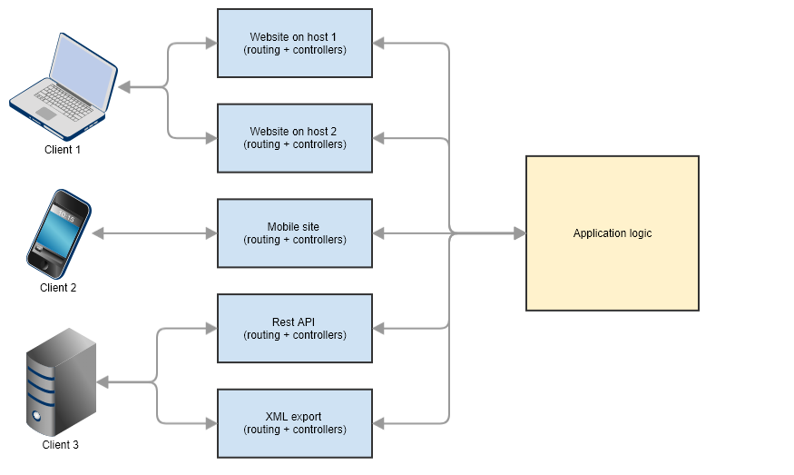

# Introduction to *ha* framework

*ha* framework  was created to allow applications that are fast and flexible to be written. The development of this framework lasted several years. Some principles have been used that have been good in other frameworks. Bad implementations were, of course, omitted. 

The development was based on the principles of service-oriented architecture ([SOA](https://en.wikipedia.org/wiki/Service-oriented_architecture)). Unlike other frameworks, application logic is clearly and precisely separate from display logic, and is clearly and precisely separate from the logic of access to the application. This means that it is not good to mix routing and controllers together with application logic.

## Different access methods are separate

For this reason, the application logic lives in a separate life, and the ways in which this logic approaches is also independent. So we can easily add or remove any access method. Access method in this case means routing logic along with controllers for example for a single website. So if we add a mobile site in the future to our application, this mobile site will use the same application logic, but a completely separate access method. The same applies, of course, to rest api, xml export for external systems, etc. So the term access method means a set of routes and controllers in a separate namespace.

As we can see, each access method is separate and can be added, edited or deleted at any time, without changing any other functionality. In this context, application logic is understood as a black box that provides some necessary functionality. And it is irrelevant, from what storage the data is loaded and where it is stored. everything controls the application logic through several application services arranged in the application logic modules. Everything is driven by application logic, which consists of several application services organized in modules.

## *ha* framework is like a lego

The main idea in framework design was to allow components to be combined arbitrarily and independently. The specific combination represents the environment and is defined by the configuration file. The environment is defined by environment name and this environment name comes into the application from outside, e.g. *ENV* variable defined in *.htaccess* file or in OS.

The access method is a specific environment, and every environment has just one configuration. This framework allows the application to be fully compiled according to the configuration. The principle is very similar to *docker-compose.yml*. Every config file in the framework represents this file. Bootstrap reads the configuration and compiles the application for the required environment.

> Because the access method, modules, and middleware used in the modules act as micro-services, we can elegantly compose our application from a configuration to whatever needs and principles of service-oriented architecture. Each item is a black box and is, in principle, independent of other items an items can be combined in multiple variations and combinations.

**Each configuration contains:**

- which version of the application is compiled
- which modules will be available in our application
- which middleware will be available in our application
- settings for middleware and modules
- which implementation will process routing (access method)

This definable application provides an incredible amount of options for the same code to work in different ways. The possibilities are multiplied by using a docker along with environment variables.

See [Configuration docs](app-configuration.md) for more informations.

## Use anything

*ha* framework does not contain any unnecessary classes and allows developers to use all your favorite packages. Thus there are no unnecessary drivers, ORM, and other ballast. There are, of course, some common drivers, but their use is optional and can be easily installed via a composer. *ha* framework also provides an interface to allow any functionality to be used as a middleware. This allows you to use any packages or classes using a few lines of code.

*ha* framework provides only an effective glue for application components and a well-written boostrap. The transition to this framework will then be able to preserve your existing code to a very large extent. Guaranteed is high reusability of your code and the separation of logical units into components that meet the elements of a service-oriented architecture.

## Change anything

*ha* framework is strictly based on interfaces, and each implementation can easily be replaced by another implementation (and this implementation is defined in config file). There is always a default implementation that should meet the requirements of versatility of use. In practice, however, there are cases where we need a very special implementation. Here is a very big problem with normal frameworks, usually we come across a point where the framework functionality change is impossible.

Framework developers usually do not allow the fact that another developer needs another implementation. *ha* framework is incomparably better in this dimension.
